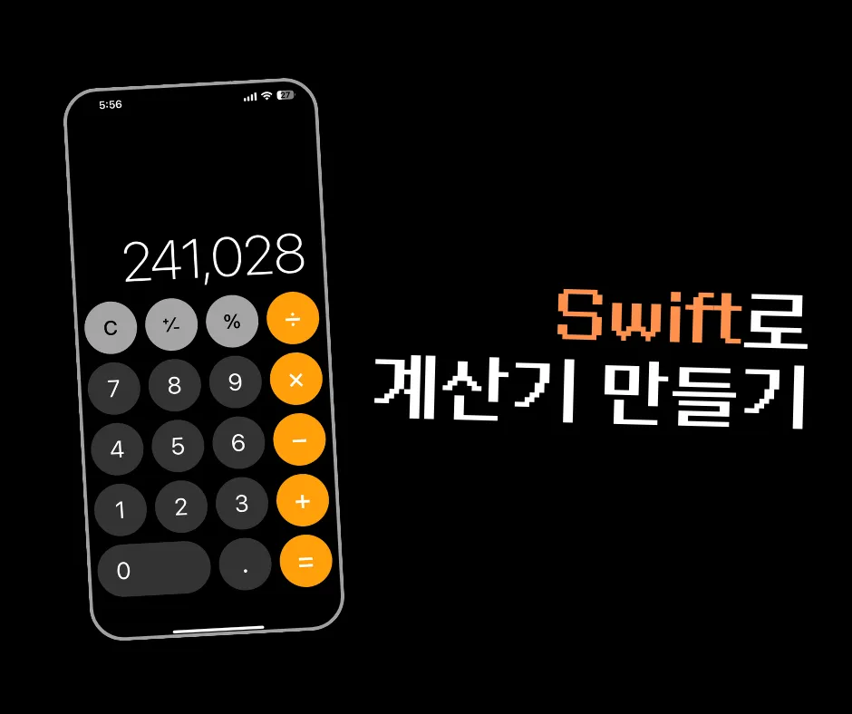

# Calculator

## 2주차 프로젝트
- swift로 계산기 만들기

필수 구현 기능
1. Lv1
   - 더하기, 빼기, 나누기, 곱하기 연산을 수행할 수 있는 Calculator 클래스를 만들기
   - 성한 클래스를 이용하여 연산을 진행하고 출력

2. Lv2
   - Lv1에서 만든 Calculator 클래스에 “나머지 연산”이 가능하도록 코드를 추가하고, 연산 진행 후 출력
   - 오류가 날 수 있는 ‘예외처리’ 상황에 대해  구현하기 
   
      - 나누기와 나머지 연산을 0으로 나눌때 계산이 안되는 상황
      - Double로 나머지 연산을 할때 오류가 나는 상황
      - "+", "-", "*", "%" 의 예외 상황을 ""에 넣을때 오류가 나는 상황

3. Lv3
   -   아래 각각의 클래스들을 만들고 클래스간의 관계를 고려하여 Calculator 클래스와 관계 맺기
    -   AddOperation(더하기)
    -  SubtractOperation(빼기)
    -   MultiplyOperation(곱하기)
    -   DivideOperation(나누기)
    -  Calculator 클래스의 내부코드를 변경
    -  관계를 맺은 후 필요하다면 별도로 만든 연산 클래스의 인스턴스를 Calculator 내부에서 사용
